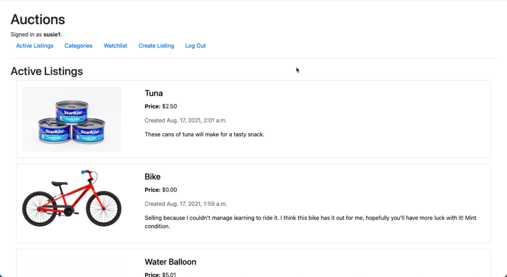

MyToyAuctionSite
================
By Andrew Kerr <kerrand@protonmail.com>

Toy implementation of an online auction website. Users can register
for accounts and create product listings, on which other users can place
bids, write comments, and add to their wishlist items.

Created using Django, Python, SQLite, HTML/CSS, and Bootstrap.
